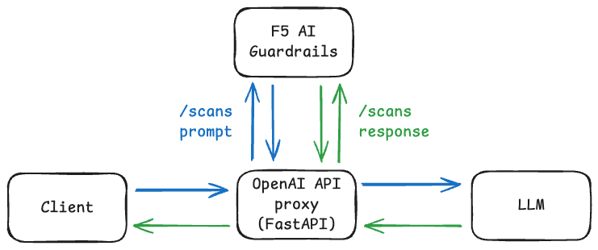

# F5 AI Guardrails integration with OpenAI API proxy

This demonstrates how an OpenAI API proxy/LLM orchestration/backend app can be integrated with F5 AI Guardrails to secure an LLM-based application.



Notes:
- the app is written in FastAPI, exposing OpenAI API's `/models` and `/chat/completion` endpoints to support connections from frontends such as Open WebUI
- supports both streaming and non-streaming responses
- supports scanning/redaction of both prompts and responses, configured via `F5_AI_GUARDRAILS_SCAN_*` and `F5_AI_GUARDRAILS_REDACT_*` variables in `.env` file

## Demo

<video src="https://github.com/leonseng/f5-ai-guardrails-openai-api-integration/blob/main/assets/demo.mp4" width="600" />

## Quickstart

```
# Create `.env` from `.env.example` and update the values in `.env`
cp .env .env.example

# Build proxy image
docker compose build

# Run the setup
docker compose up
```

Browse to [http://localhost:8080](http://localhost:8080) to access Open WebUI.

Send a prompt and observe scan logs, e.g.
```

```

Confirm scan results on F5 AI Guardrails console.

## Development

1. Create a virtual environment and install dependencies:

```bash
python -m venv .venv
source .venv/bin/activate
pip install -r requirements.txt
```

2. Run the server:

```bash
export BACKEND_URL=http://192.168.0.4:11434
uvicorn main:app --host 0.0.0.0 --port 8000
```

3. Example curl (proxying a chat completions request):

```bash
curl -X POST "http://localhost:8000/v1/chat/completions" \
  -H "Content-Type: application/json" \
  -d '{"model":"gpt-4o-mini","messages":[{"role":"user","content":"Hello"}]}'
```
